# Awesome IIUM Architecture

**Version:** 1.0.0  
**Last Updated:** February 4, 2026  
**Maintainer:** IIUMstudent Team

---

## Table of Contents

- [System Overview](#system-overview)
- [Technology Stack](#technology-stack)
- [Architecture Diagram](#architecture-diagram)
- [Data Flow](#data-flow)
- [Caching Strategy](#caching-strategy)
- [API Integration](#api-integration)
- [Build Process](#build-process)
- [Deployment Pipeline](#deployment-pipeline)
- [Security Architecture](#security-architecture)
- [Performance Optimization](#performance-optimization)
- [Error Handling & Monitoring](#error-handling--monitoring)

---

## System Overview

### Project Type

**Static Site Generation (SSG)** with Progressive Web App (PWA) capabilities

### Core Pattern

Build-time data fetching + Client-side hydration for dynamic updates

### Deployment

GitHub Pages (CDN-distributed static site)

### Architecture Philosophy

1. **Build-time optimization** - Fetch data during build, cache aggressively
2. **Progressive enhancement** - Works without JavaScript, enhanced with JS
3. **Performance-first** - All interactive features lazy-loaded
4. **Accessibility-first** - WCAG 2.1 Level AA compliance throughout

---

## Technology Stack

### Frontend Framework

```yaml
Core: Astro 5.17.1 (SSG framework)
UI: Starlight (Astro documentation theme)
Styling: CSS Custom Properties + Starlight tokens
Interactivity: Vanilla JavaScript (islands architecture)
```

### Build Tools

```yaml
Package Manager: pnpm
Bundler: Vite (via Astro)
Minification: esbuild
Source Maps: Enabled in production
Bundle Analysis: rollup-plugin-visualizer
```

### Testing Suite

```yaml
Unit Tests: Vitest + happy-dom
E2E Tests: Playwright
Accessibility: axe-core + pa11y-ci
Performance: Lighthouse CI
```

### External Services

```yaml
Error Tracking: Sentry (optional, requires DSN)
Analytics: GoatCounter (privacy-first, no cookies)
API Data: GitHub API (contributors, commits, PRs)
Prayer Times: Aladhan.com API
```

### Progressive Web App

```yaml
Service Worker: Workbox (via @vite-pwa/astro)
Strategy: Network-first with cache fallback
Offline: Static assets cached, dynamic content cached on visit
```

---

## Architecture Diagram

### High-Level System Architecture

```mermaid
graph TB
    subgraph Build["⚙️ Build Time (GitHub Actions)"]
        Source[Source Code<br/>Markdown + Astro]
        Build[Astro Build<br/>SSG Process]
        APIs[External APIs<br/>GitHub, Aladhan]
        
        Source --> Build
        Build -->|Fetch Data| APIs
        Build --> Dist[dist/<br/>Static HTML]
    end
    
    subgraph Deploy["🚀 Deployment"]
        Dist --> Pages[GitHub Pages<br/>CDN]
    end
    
    subgraph Runtime["💻 Client Runtime"]
        Pages --> Browser[User Browser]
        Browser -->|Install| SW[Service Worker<br/>Cache Strategy]
        Browser -->|Hydrate| Islands[Interactive Islands]
        
        Islands -->|Dynamic Fetch| Cache[Browser Cache<br/>localStorage]
        Islands -->|API Calls| APIS2[External APIs]
        Islands -->|Error Tracking| Sentry[Sentry.io]
        Islands -->|Analytics| GC[GoatCounter]
    end
    
    style Build fill:#e3f2fd
    style Deploy fill:#f3e5f5
    style Runtime fill:#e8f5e9
```

### Component Architecture (Islands Pattern)

```mermaid
graph LR
    subgraph Astro["Astro Pages"]
        Page[📄 Page Component<br/>.astro]
    end
    
    subgraph Static["Static Content"]
        MD[📝 Markdown<br/>Content]
        CSS[🎨 Styles]
    end
    
    subgraph Interactive["Interactive Islands"]
        GPA[📊 GPA Calculator]
        Prayer[🕌 Prayer Times]
        Map[🗺 Campus Map]
        Dashboard[📈 Status Dashboard]
    end
    
    subgraph Utilities["Shared Utilities"]
        ErrorUtils[errors.ts<br/>Error Handling]
        APIUtils[github.ts<br/>aladhan.ts<br/>API Clients]
        SentryUtils[sentry.ts<br/>Monitoring]
        GPAUtils[gpa.ts<br/>Calculations]
    end
    
    Page --> Static
    Page --> Interactive
    Interactive --> Utilities
    
    style Interactive fill:#fff3e0
    style Utilities fill:#e0f7fa
```



---

## Data Flow

### Build-Time Data Flow


### Runtime Data Flow


---

## Caching Strategy

### Multi-Layer Caching System


### Cache Configuration

#### 1. Build-Time Cache

**Location:** `.astro/cache/` directory  
**TTL:** 24 hours  
**Purpose:** Avoid hitting GitHub API rate limits during development

**Files:**

- `leaderboard-cache.json` - Contributors data
- `new-this-week-cache.json` - Recent commits
- `activity-feed.json` - Activity data

**Implementation:**

```javascript
const CACHE_DIR = path.join(process.cwd(), '.astro');
const CACHE_FILE = path.join(CACHE_DIR, 'component-cache.json');
const CACHE_DURATION = 24 * 60 * 60 * 1000; // 24 hours

// Read from cache if fresh
if (fs.existsSync(CACHE_FILE)) {
  const stats = fs.statSync(CACHE_FILE);
  if (Date.now() - stats.mtimeMs < CACHE_DURATION) {
    return JSON.parse(fs.readFileSync(CACHE_FILE, 'utf-8'));
  }
}

// Fetch and write to cache
await fs.writeFile(CACHE_FILE, JSON.stringify(data));
```

#### 2. Service Worker Cache

**Strategy:** Workbox with custom rules  
**Registration:** `autoUpdate` mode

**Rules:**

```javascript
{
  globPatterns: ['**/*.{js,css,html,ico,png,svg,webp,json}'],
  navigateFallback: '/Awesome-IIUM/',
  runtimeCaching: [
    {
      urlPattern: /^https:\/\/api\.github\.com\/.*/i,
      handler: 'NetworkFirst',
      options: {
        cacheName: 'github-api',
        expiration: {
          maxEntries: 50,
          maxAgeSeconds: 3600, // 1 hour
        }
      }
    }
  ]
}
```

#### 3. localStorage Cache

**TTL:** 1 hour (configurable per component)  
**Purpose:** Reduce API calls for frequently accessed data

**Implementation:**

```javascript
const CACHE_KEY = 'prayer-times-gombak-2026-02-04';
const cached = localStorage.getItem(CACHE_KEY);

if (cached) {
  const { data, timestamp } = JSON.parse(cached);
  if (Date.now() - timestamp < 3600000) { // 1 hour
    return data;
  }
}

// Fetch new data and cache
const newData = await fetchAPI();
localStorage.setItem(CACHE_KEY, JSON.stringify({
  data: newData,
  timestamp: Date.now()
}));
```

---

## API Integration

### GitHub API Integration

**Purpose:** Fetch contributors, commits, and pull requests


**Features:**

- ✅ Exponential backoff retry (1s, 2s, 4s)
- ✅ Rate limit detection via headers
- ✅ Automatic fallback to static data
- ✅ Optional GitHub token support (5000 req/hr vs 60)
- ✅ Error logging to Sentry (production only)

**Rate Limits:**

| Auth Method | Rate Limit | Recommended For |
|-------------|-----------|----------------|
| Unauthenticated | 60 req/hour | Development (with cache) |
| GitHub Token | 5,000 req/hour | Production builds |

**Configuration:**

```bash
# .env (optional)
GITHUB_TOKEN=ghp_xxxxxxxxxxxx
```

### Aladhan API Integration

**Purpose:** Fetch Islamic prayer times for IIUM campuses


**Features:**

- ✅ Campus-specific coordinates (Gombak, Kuantan, Pagoh, Gambang)
- ✅ Auto-update countdown every minute
- ✅ Hijri date display
- ✅ Next prayer highlighting
- ✅ localStorage caching (1 hour TTL)
- ✅ Graceful fallback on API failure

**API Endpoint:**

```
GET https://api.aladhan.com/v1/timings/{timestamp}
  ?latitude={lat}&longitude={lng}&method=3
```

**Cache Strategy:**

```javascript
const cacheKey = `prayer-${campus}-${dateString}`;
const cached = localStorage.getItem(cacheKey);
cacheValidFor = 1 hour
```

### API Error Handling

**Centralized via `errors.ts`:**


**Error Categories:**

- `NETWORK` - Connection issues (retryable)
- `API` - HTTP errors (retryable)
- `TIMEOUT` - Request timeout (retryable)
- `RATE_LIMIT` - API rate limit (wait and retry)
- `VALIDATION` - Invalid data (not retryable)
- `UNKNOWN` - Other errors (logged)

---

## Build Process

### Build Pipeline

```mermaid
graph TD
    Start[🔨 pnpm build] --> Sync[Content Sync]
    Sync --> Types[Generate Types]
    Types --> Fetch[Fetch Build-Time Data]
    
    Fetch --> GitHub[GitHub API<br/>Contributors, Commits]
    Fetch --> Aladhan[Aladhan API<br/>Prayer Times Preview]
    
    GitHub --> Cache[Cache to .astro/]
    Aladhan --> Cache
    
    Cache --> Render[Render .astro Components]
    Render --> MDX[Process MDX Content]
    MDX --> Bundle[Bundle JS/CSS]
    
    Bundle --> Minify[Minify with esbuild]
    Minify --> Console[Strip console.log]
    Console --> SourceMap[Generate Source Maps]
    
    SourceMap --> Images[Optimize Images<br/>Sharp]
    Images --> PWA[Generate PWA Assets<br/>Service Worker, Manifest]
    
    PWA --> Sitemap[Generate Sitemap]
    Sitemap --> Output[📦 Output to dist/]
    
    Output --> Stats[Bundle Stats<br/>stats.html]
    Output --> Done[✅ Build Complete]
    
    style Start fill:#e3f2fd
    style Done fill:#e8f5e9
```



### Build Artifacts

**Output Directory:** `dist/`

```
dist/
├── index.html                    # Homepage
├── dashboard/index.html          # Dashboard page
├── _astro/                       # Optimized assets
│   ├── *.js                      # Minified JavaScript
│   ├── *.css                     # Minified CSS
│   └── *.webp                    # Optimized images
├── sw.js                         # Service Worker
├── workbox-*.js                  # Workbox runtime
├── manifest.webmanifest          # PWA manifest
├── registerSW.js                 # SW registration
├── sitemap-index.xml             # Site structure
└── stats.html                    # Bundle analysis
```

### Build Configuration

**astro.config.mjs:**

```javascript
{
  site: 'https://iiumstudent.github.io',
  base: '/Awesome-IIUM',
  vite: {
    build: {
      sourcemap: true,      // Debug production errors
      minify: 'esbuild',    // Fast minification
    },
    esbuild: {
      pure: ['console.log', 'console.warn', 'console.info'], // Production only
    },
  },
}
```

**Build Optimizations:**

- ✅ Dead code elimination (tree-shaking)
- ✅ console.log stripping (production)
- ✅ Image optimization (Sharp)
- ✅ CSS minification
- ✅ JavaScript minification
- ✅ Source map generation
- ✅ Bundle size analysis

---

## Deployment Pipeline

### CI/CD Flow

```mermaid
graph TD
    Push[📝 Git Push] --> CI{CI/CD<br/>GitHub Actions}
    
    CI --> Lint[🔍 Lint & Format<br/>Biome + markdownlint]
    CI --> Test[🧪 Tests<br/>Vitest + Playwright]
    CI --> A11y[♿ Accessibility<br/>axe-core + pa11y-ci]
    CI --> Security[🔒 Security<br/>npm audit]
    
    Lint --> Pass{All Pass?}
    Test --> Pass
    A11y --> Pass
    Security --> Pass
    
    Pass -->|No| Fail[❌ Build Failed]
    Pass -->|Yes| Build[⚙️ Astro Build]
    
    Build --> Sentry[📤 Upload Source Maps<br/>Sentry]
    Build --> Deploy[🚀 Deploy to GitHub Pages]
    
    Deploy --> Lighthouse[📊 Lighthouse CI<br/>Performance Report]
    Lighthouse --> Live[✅ Live at<br/>iiumstudent.github.io]
    
    style Push fill:#e3f2fd
    style Live fill:#e8f5e9
    style Fail fill:#ffebee
```



### Deployment Configuration

**GitHub Actions Workflow:** `.github/workflows/deploy.yml`

```yaml
name: Deploy to GitHub Pages

on:
  push:
    branches: [master]
  workflow_dispatch:

jobs:
  build-and-deploy:
    runs-on: ubuntu-latest
    steps:
      - uses: actions/checkout@v4
      
      - name: Setup Node & pnpm
        uses: actions/setup-node@v4
        with:
          node-version: '20'
          
      - uses: pnpm/action-setup@v4
        with:
          version: 9
      
      - name: Install dependencies
        run: pnpm install
      
      - name: Lint
        run: pnpm run lint
      
      - name: Test
        run: pnpm test && pnpm test:e2e
      
      - name: Build
        run: pnpm build
        env:
          GITHUB_TOKEN: ${{ secrets.GITHUB_TOKEN }}
          NODE_ENV: production
      
      - name: Upload to Sentry
        run: pnpm run sentry:upload
        env:
          SENTRY_AUTH_TOKEN: ${{ secrets.SENTRY_AUTH_TOKEN }}
      
      - name: Deploy to GitHub Pages
        uses: peaceiris/actions-gh-pages@v4
        with:
          github_token: ${{ secrets.GITHUB_TOKEN }}
          publish_dir: ./dist
```

**Deployment Triggers:**

- ✅ Push to `master` branch (automatic)
- ✅ Manual workflow dispatch (on-demand)
- ✅ Pull request preview (optional)

**Deployment Environment:**

- **Platform:** GitHub Pages
- **CDN:** GitHub's global CDN
- **HTTPS:** Automatic with custom domain support
- **Cache:** GitHub Pages CDN cache (10 min default)

---

## Security Architecture

### Security Layers

```mermaid
graph TD
    User[👤 User Request] --> CDN[GitHub Pages CDN<br/>HTTPS Only]
    
    CDN --> Headers[Security Headers<br/>CSP, HSTS, X-Frame]
    
    Headers --> Content[Static Content<br/>No Server-Side Code]
    
    Content --> Sanitize[Input Sanitization<br/>Markdown, HTML]
    
    Sanitize --> APIs[External APIs<br/>Rate Limited]
    
    APIs --> Sentry[Error Monitoring<br/>Sentry.io]
    
    style Headers fill:#ffebee
    style Content fill:#e8f5e9
```



### Security Headers

**Configured in Astro:**

```javascript
// Public/_headers (GitHub Pages doesn't support, use Cloudflare if needed)
/*
  X-Frame-Options: DENY
  X-Content-Type-Options: nosniff
  Referrer-Policy: strict-origin-when-cross-origin
  Permissions-Policy: geolocation=(), microphone=(), camera=()
```

**Content Security Policy (CSP):**

- ✅ No inline scripts (except necessary hydration)
- ✅ External scripts from trusted CDNs only (goatcounter, giscus)
- ✅ No eval() or similar dynamic execution
- ✅ Images from trusted domains

### Authentication & Authorization

**Current State:** None required (public information)

**Future Considerations:**

- GitHub OAuth for content contribution
- Admin panel for verified badge management
- Role-based access control for editors

### Data Privacy

**GDPR Compliance:**

- ✅ No cookies used
- ✅ GoatCounter analytics (no PII, EU-compliant)
- ✅ No user tracking across sites
- ✅ GitHub API data is public information
- ✅ No localStorage of personal data

**Privacy Policy:** See `PRIVACY.md` (Task 30)

---

## Performance Optimization

### Performance Budget

**Lighthouse CI Thresholds:**

```json
{
  "performance": 80,
  "accessibility": 95,
  "best-practices": 90,
  "seo": 90
}
```

**Core Web Vitals:**

- **LCP (Largest Contentful Paint):** < 2.5s
- **FID (First Input Delay):** < 100ms
- **CLS (Cumulative Layout Shift):** < 0.1

### Optimization Techniques

```mermaid
graph LR
    subgraph Build["Build-Time"]
        SSG[Static Generation]
        TreeShake[Tree Shaking]
        Minify[Minification]
        ImageOpt[Image Optimization]
    end
    
    subgraph Runtime["Runtime"]
        LazyLoad[Lazy Loading]
        CodeSplit[Code Splitting]
        Cache[Aggressive Caching]
        Preload[Resource Preloading]
    end
    
    SSG --> Fast[⚡ Fast Initial Load]
    TreeShake --> Small[📦 Small Bundles]
    Minify --> Small
    ImageOpt --> Fast
    
    LazyLoad --> Interactive[✨ Quick Interactive]
    CodeSplit --> Small
    Cache --> Fast
    Preload --> Fast
    
    style Fast fill:#e8f5e9
    style Small fill:#e8f5e9
    style Interactive fill:#e8f5e9
```



**Implemented Optimizations:**

1. **Static Site Generation (SSG)**
   - All pages pre-rendered at build time
   - No server-side processing at runtime
   - Instant page loads from CDN

2. **Code Splitting (Automatic)**
   - Astro islands architecture
   - Components loaded only when needed
   - Separate bundles for each interactive component

3. **Image Optimization**
   - Automatic WebP conversion
   - Responsive images with `srcset`
   - Lazy loading (`loading="lazy"`)
   - Sharp for build-time processing

4. **CSS Optimization**
   - Critical CSS inlined
   - Non-critical CSS deferred
   - CSS modules for component isolation
   - Purge unused styles (automatic)

5. **JavaScript Optimization**
   - Minimal client-side JS (<50KB total)
   - Tree-shaking removes unused code
   - esbuild minification
   - console.log stripped in production

6. **Caching Strategy**
   - Service Worker caches all assets
   - localStorage for API responses
   - HTTP cache headers (GitHub Pages)
   - Build-time cache for development

7. **Resource Hints**
   - `<link rel="preconnect">` for external APIs
   - `<link rel="dns-prefetch">` for third-party scripts
   - Critical resources preloaded

### Bundle Size Targets

| Resource Type | Budget | Current | Status |
|--------------|--------|---------|--------|
| HTML (gzip) | < 30 KB | ~18 KB | ✅ |
| JavaScript (gzip) | < 100 KB | ~73 KB | ✅ |
| CSS (gzip) | < 50 KB | ~22 KB | ✅ |
| Images | < 500 KB | ~150 KB | ✅ |
| Total Initial Load | < 300 KB | ~220 KB | ✅ |

**Verification:**

```bash
pnpm build
ls -lh dist/stats.html  # View bundle analysis
```

---

## Error Handling & Monitoring

### Error Handling Architecture


### Sentry Integration

**Purpose:** Production error tracking and monitoring

**Configuration:**

```javascript
// astro.config.mjs
sentry({
  enabled: !!process.env.PUBLIC_SENTRY_DSN,
  dsn: process.env.PUBLIC_SENTRY_DSN,
  environment: process.env.NODE_ENV || 'production',
  release: process.env.SENTRY_RELEASE,
  sourceMapsUploadOptions: {
    enabled: !!process.env.SENTRY_AUTH_TOKEN,
    authToken: process.env.SENTRY_AUTH_TOKEN,
    org: process.env.SENTRY_ORG,
    project: process.env.SENTRY_PROJECT,
  },
})
```

**Features:**

- ✅ Automatic error capture
- ✅ Source map support (debug minified code)
- ✅ Breadcrumb tracking (user actions before error)
- ✅ Performance monitoring (10% sample rate)
- ✅ Session replay (10% normal, 100% on error)
- ✅ Release tracking (version tagging)

**Filtered Errors:**

- ❌ GitHub API rate limits (handled gracefully)
- ❌ Network timeout errors (expected, show fallback)
- ❌ AbortError (intentional cancellations)
- ✅ Unexpected errors (logged to Sentry)

### Error Handling Patterns

**Pattern 1: Async with Retry**

```typescript
import { withRetry } from '@/utils/errors';

const data = await withRetry(
  () => fetch('/api/data').then(r => r.json()),
  {
    maxRetries: 3,
    fallback: [],
    context: 'Dashboard data fetch'
  }
);
```

**Pattern 2: Try-Catch with Fallback**

```typescript
import { handleError } from '@/utils/errors';

try {
  const data = await fetchAPI();
} catch (error) {
  const errorResponse = handleError(error, 'API call');
  return fallbackData;
}
```

**Pattern 3: Error Component UI**

```typescript
import { createErrorMarkup } from '@/utils/errors';

const errorHTML = createErrorMarkup(errorResponse, {
  showDetails: import.meta.env.DEV,
  includeRetry: true
});
```

### Monitoring Dashboard

**Sentry Dashboard Metrics:**

- Error count by component
- Error rate over time
- User affected count
- Response time percentiles
- Core Web Vitals

**Alerts:**

- Spike in error rate (>5% increase)
- New error types
- Performance regression (LCP > 3s)

---

## Development Workflow

### Local Development

```bash
# Install dependencies
pnpm install

# Start dev server
pnpm dev
# → http://localhost:4321/Awesome-IIUM/

# Run tests
pnpm test              # Unit tests
pnpm test:e2e          # E2E tests
pnpm test:a11y         # Accessibility tests

# Lint and format
pnpm run lint          # Check code quality
pnpm run format        # Auto-fix formatting

# Build for production
pnpm build             # Output to dist/
pnpm preview           # Preview production build
```

### Development Tools

**VS Code Extensions (Recommended):**

- Astro (astro-build.astro-vscode)
- Biome (biomejs.biome)
- Playwright Test (ms-playwright.playwright)
- Markdownlint (DavidAnson.vscode-markdownlint)

**Browser DevTools:**

- Lighthouse (performance auditing)
- Axe DevTools (accessibility testing)
- Network tab (API monitoring)
- Application tab (Service Worker, Cache)

---

## Future Architecture Considerations

### Potential Enhancements

1. **Edge Functions (Cloudflare)**
   - Server-side rendering for search
   - API rate limiting at edge
   - Geographic content delivery

2. **Database Integration**
   - Supabase for user-contributed content
   - Real-time updates via WebSockets
   - Authentication for content submission

3. **Search Enhancement**
   - Algolia for faster search
   - Fuzzy search with typo tolerance
   - Search analytics

4. **Content Management**
   - Decap CMS for non-technical editors
   - Visual editing interface
   - Workflow approval system

5. **Internationalization (i18n)**
   - Expand beyond current 5 languages
   - Dynamic language switching
   - Crowdsourced translations

---

## References

### Documentation

- [Astro Documentation](https://docs.astro.build/)
- [Starlight Theme](https://starlight.astro.build/)
- [Workbox (PWA)](https://developers.google.com/web/tools/workbox)
- [Sentry Documentation](https://docs.sentry.io/)

### Related Files

- `SETUP.md` - Development setup guide
- `CONTRIBUTING.md` - Contribution guidelines
- `SECURITY.md` - Security policy
- `ACCESSIBILITY.md` - Accessibility documentation
- `README.md` - Project overview

### Contact

- **GitHub:** [IIUMstudent/Awesome-IIUM](https://github.com/iiumstudent/Awesome-IIUM)
- **Issues:** [Report bugs or request features](https://github.com/iiumstudent/Awesome-IIUM/issues)
- **Discussions:** [Community discussions](https://github.com/iiumstudent/Awesome-IIUM/discussions)

---

**Last Updated:** February 4, 2026  
**Architecture Version:** 1.0.0
